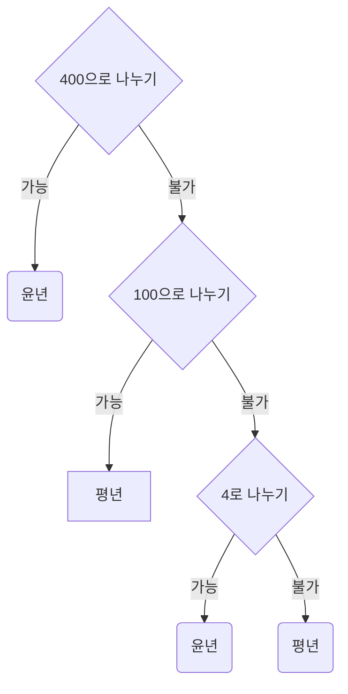

# Datepicker

🔗 [링크](https://itso-wavy.github.io/JS-challenges/Datepicker/index.html)

- [x] input 누르면 calendar display를 토글하기
- [x] 현재 날짜 year, month로 기본 세팅
  - [x] `<`, `>` 버튼 누르면 year, month 바꾸기
  - [x] 년, 월 직접 선택시 year, month 바꾸기
  - [x] year, month 바뀌면 년, 월 바꿔 보여주기
- [x] year, month 바뀔 때 calendar 배열 바꾸기
  - [x] calendar는 앞 공백 + 숫자 + 뒷 공백으로 구성
  - [x] 각 월의 배열 만들기 
  - [x] 윤년인지 판단
  - [x] calendar 내용 바뀌면 재렌더링 하기
- [x] day 누르면 input 업데이트하고 calendar 숨기기

---

